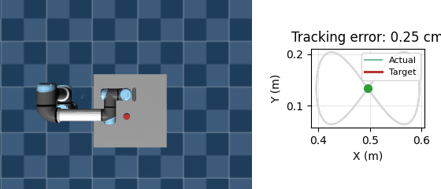
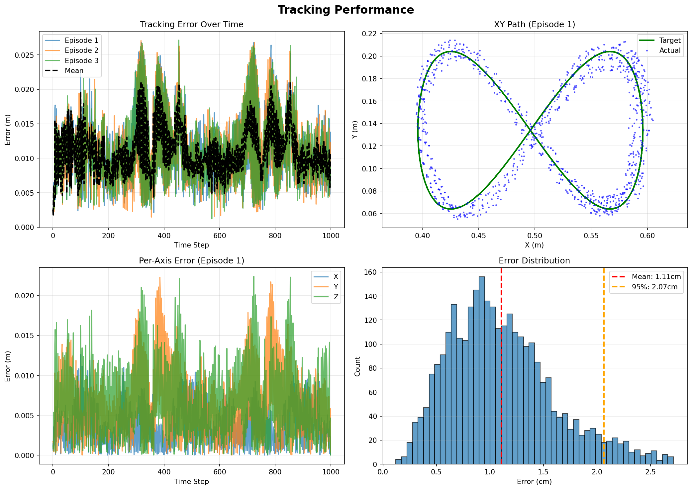

# UR5e Figure-Eight Tracking with Reinforcement Learning

A UR5e robotic arm learning to trace a figure-eight in MuJoCo, trained from scratch using SAC with observation noise and control delay baked in from day one.



---

## Results

| Metric | Value |
|--------|-------|
| Mean tracking error | 1.10 cm |
| Std | 0.49 cm |
| 95th percentile | 2.07 cm |
| Max error | 2.77 cm |
| Training | 1M steps, SAC |
| Automated tests | 24 |



---

## What it does

The arm starts from a resting position and learns, purely through trial and error, to chase a moving target that traces a lemniscate (figure-eight) path in 3D space. No hand-crafted controllers. No motion planning. Just a reward signal and 1,000,000 steps of SAC.

The policy ends up robust to three sources of uncertainty it was trained with throughout:
- **Observation noise** — the agent never sees the true joint state, only a noisy version
- **Control delay** — what the arm executes right now is what the agent decided 2 steps ago
- **Action noise** — small Gaussian noise is added to every action before execution, simulating motor imprecision

---

## Quickstart

```bash
# Install
pip install -r requirements.txt

# Train (1M steps, ~2.5 hours on CPU)
python train.py

# Evaluate + generate plots and video
python evaluate.py

# Run tests
pytest tests/ -v
```

---

## Project structure

```
├── env/
│   └── tracking_env.py     # Gym environment — noise, delay, reward
├── assets/
│   └── scene.xml           # MuJoCo UR5e scene
├── tests/
│   └── test_env.py         # 24 tests covering trajectory maths + env correctness
├── trajectory.py           # Lemniscate trajectory generator
├── train.py                # SAC training with VecNormalize
├── evaluate.py             # Plots + video generation
├── models/
│   ├── best/best_model.zip         # Best checkpoint by eval reward
│   └── vecnormalize_best.pkl       # Normalisation stats — must match best_model.zip
└── results/
    └── tracking_results.png
```

---

## Design choices

### Trajectory

Parametric lemniscate sampled at each timestep:

```
x(t) = cx + sx · sin(θ)
y(t) = cy + sy · sin(2θ)    ← sin(2θ) creates the crossing point
z(t) = cz                   ← fixed height
```

Parameters: `centre=(0.496, 0.134, 0.579)`, `scale_x=0.10`, `scale_y=0.07`, `period=8.0s`

A circle with constant curvature and constant angular velocity means a policy can get away with spinning joints at a fixed speed. The figure-eight has direction reversals and varying curvature, so the policy must actively track.

Analytical velocity is derived and fed directly to the agent so it knows not just where the target is, but where it's heading next. The policy is purely reactive (no future waypoints), which is harder but more general.

### State space (21 dimensions)

```
6  joint positions      (noisy)
6  joint velocities     (noisy)
3  target XYZ position
3  target XYZ velocity
3  end-effector XYZ position
```

Including target velocity was important — without it, the agent lags on the fast direction-reversal parts of the figure-eight. Including the tracking error explicitly wasn't needed; the agent learns to compute it from the state.

### Action space

Normalised joint velocity commands `[-1, 1]`, scaled by `3.14 rad/s` per joint. Velocity control rather than torque control is simpler, more stable, and doesn't require tuning a separate low-level controller.

Each action goes through two stages before reaching the joints. First, Gaussian noise (`σ = 0.001`) is added to simulate motor imprecision — the arm never executes exactly what was commanded. Second, the noisy action enters a 2-step delay buffer, so what actually moves the joints is what was decided 2 timesteps ago. The policy learns to compensate for both without any explicit knowledge that they exist.

### Reward

```python
reward = exp(-5.0 * dist)          # track the target from far away
       + exp(-50.0 * dist) * 2.0   # strong bonus for getting really close
       - 0.001 * ||qacc||          # penalise jerky motion
       - 0.0001 * ||ctrl||²        # penalise wasted effort
```

The dual exponential was the key insight — a single `exp(-k * dist)` either learns coarse tracking or precise tracking, not both. The wide term guides the arm when it's far from the target; the narrow term rewards millimetre-level precision. The acceleration penalty was the single biggest improvement to motion smoothness.

### Algorithm: SAC

SAC was the natural choice for continuous control:
- Off-policy with a replay buffer — far more sample-efficient than PPO for this kind of task
- Entropy regularisation discourages high-frequency action changes, which complements the explicit smoothness penalty
- Stable enough to run 1M steps without diverging

Policy: `[256, 256]` MLP. Normalised observations and rewards via `VecNormalize`.

### Uncertainty

**Observation noise** (`σ = 0.002`) on joint positions and velocities mimics encoder noise in real hardware.

**Action noise** (`σ = 0.001`) added to every joint command before execution simulates motor imprecision — the arm never moves exactly as instructed.

**Control delay** (2 steps) via a `collections.deque` action buffer — the arm executes what was commanded 2 timesteps ago. This is genuinely hard for classical controllers and something the RL policy handles implicitly by learning to anticipate.

All three are present during training, so the policy is robust to them rather than just exposed to them at eval time.

### The hardest bug

`VecNormalize` running statistics must be saved at the **exact moment** the best model checkpoint is written. If you save them at the end of training, the normalisation may have drifted, resulting in a policy that performs poorly — I measured a 40cm error from a well-trained model this way.

Fixed with a custom `SaveVecNormalizeCallback` that hooks into `EvalCallback` and saves matching stats every time a new best model is found.

---

## Requirements

```
Python 3.9+
MuJoCo 3.x        (installs via pip)
PyTorch            (installed as SB3 dependency)
```

Full list in `requirements.txt`.

---

## References

- [Soft Actor-Critic (Haarnoja et al., 2018)](https://arxiv.org/abs/1812.05905)
- [Stable-Baselines3](https://stable-baselines3.readthedocs.io/)
- [MuJoCo](https://mujoco.org/)
- [Gymnasium](https://gymnasium.farama.org/)
